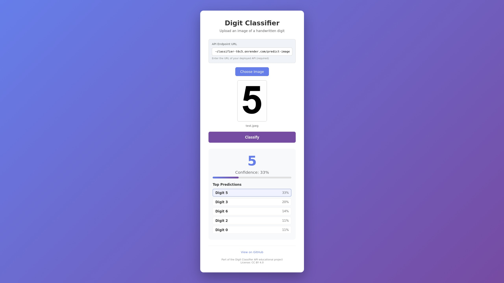
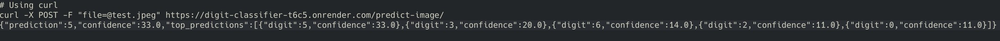

# Digit Classifier API



An educational project that teaches how to build a machine learning web application using Python, FastAPI, and scikit-learn. Learn to train a model on the MNIST dataset, create a REST API, and deploy to the cloud.

<br><br>
<br><br>
<br><br>
<br><br>


## Table of Contents

- [Features](#features)

- [Demo](#demo)

- [Quick Start](#quick-start)

- [Prerequisites](#prerequisites)

- [Installation](#installation)

- [Training the Model](#training-the-model)

- [Running Locally](#running-locally)

- [Using the Application](#using-the-application)

- [API Documentation](#api-documentation)

- [Deploying to Render](#deploying-to-render)

- [Using the API](#using-the-api)

- [Model Compression](#model-compression)

- [Project Structure](#project-structure)

- [Tech Stack](#tech-stack)

- [License](#license--attribution)

- [Acknowledgments](#acknowledgments)

---

## Features

- **Handwritten Digit Recognition**: Recognizes digits 0-9 from uploaded images.

- **Confidence Scores**: Shows prediction confidence percentage.

- **Top 5 Predictions**: Displays the top 5 most likely digits with probabilities.

- **Image Preview**: Shows uploaded image before classification.

- **Modern UI**: Clean, responsive design that works on mobile and desktop.

- **REST API**: Full REST API for programmatic access.

- **Cloud Deployment**: Deployable to Render for free tier public access.

- **Input Validation**: Validates file type and size.

- **Error Handling**: User-friendly error messages.

---

## Demo

Try it out locally or deploy to the cloud. The application provides:

1. A web interface for uploading digit images.

2. Real-time preview of uploaded images.

3. Classification results with confidence scores.

4. A REST API that can be called from any system.

---

## Quick Start

Get up and running quickly:

```bash
# 1. Clone the repository
git clone https://github.com/HelixCipher/digit-classifier-api.git
cd digit-classifier-api

# 2. Install dependencies
pip install -r requirements.txt

# 3. Run the server (pre-trained model included)
uvicorn main:app --reload --port 3000

# 4. Open your browser
# Navigate to http://localhost:3000
```

---

## GitHub Secrets

To enable the auto-ping workflow that keeps Render from spinning down:

1. Go to your GitHub repo → Settings → Secrets and variables → Actions
2. Add a new secret:
   - **Name:** `RENDER_HEALTHCHECK_URL`
   - **Value:** `https://your-app.onrender.com/health`

This triggers the workflow in `.github/workflows/ping-render.yml` to ping your Render app every 10 minutes.

---

## Prerequisites

Before you begin, ensure you have the following:

- **Python 3.8+** - Download from python.org

- **Git** - For version control

- **GitHub Account** - For deployment (optional)

- **Render Account** - For cloud deployment (optional, free tier)

---

## Installation

### 1. Clone the Repository

```bash
git clone https://github.com/HelixCipher/digit-classifier-api.git
cd digit-classifier-api
```

### 2. Create a Virtual Environment (Recommended)

```bash
# On Windows
python -m venv venv
venv\Scripts\activate

# On macOS/Linux
python3 -m venv venv
source venv/bin/activate
```

### 3. Install Dependencies

```bash
pip install -r requirements.txt
```

---

## Training the Model

The project already includes a pre-trained model (`model.zlib`), but here's how to train your own:

### Option 1: Using the Script

```bash
python train_model.py
```

This will:

1. Load the MNIST dataset (60,000 training images, 10,000 test images).

2. Train a Random Forest classifier.

3. Evaluate accuracy on the test set.

4. Save the model as `model.pkl` (original) and `model.zlib` (compressed).

### Option 2: Using the Jupyter Notebook

Open the notebook for a complete step-by-step guide:

```bash
jupyter notebook digit_classifier.ipynb
```

The notebook includes:

- Detailed explanations of each step

- Data visualization

- Model training and evaluation

- Model compression techniques

---

## Running Locally

### Starting the Server

```bash
uvicorn main:app --reload --port 3000
```

Parameters explained:

- `main:app` - The FastAPI application object in main.py

- `--reload` - Auto-restart on code changes (useful for development)

- `--port 3000` - Run on port 3000

### Accessing the Application

Open your browser and navigate to:

- **http://localhost:3000** - Main web interface

- **http://localhost:3000/docs** - Auto-generated API documentation

- **http://localhost:3000/predict-image/** - Prediction endpoint

---

## Using the Application

1. **Open the web interface** at http://localhost:3000

2. **Click "Choose Image"** to select a handwritten digit image

3. **Preview** your selected image

4. **Click "Classify"** to get predictions

5. **View results** including:

   - The predicted digit

   - Confidence percentage

   - Top 5 predictions with probabilities

### Image Requirements

For best results, your image should:

- Be a clear image of a handwritten digit (0-9)

- Be in JPEG, PNG, GIF, or WebP format

- Be under 5MB in size

- Show the digit clearly on a contrasting background

---

## API Documentation

### Endpoints

#### 1. Home Page
```
GET /
```
Returns the HTML interface.

#### 2. Predict Digit
```
POST /predict-image/
```
Upload an image file to get digit prediction.

**Parameters:**
- `file` (required): Image file (JPEG, PNG, GIF, or WebP)

**Response:**
```json
{
  "prediction": 5,
  "confidence": 94.32,
  "top_predictions": [
    {"digit": 5, "confidence": 94.32},
    {"digit": 3, "confidence": 3.21},
    {"digit": 8, "confidence": 1.45},
    {"digit": 9, "confidence": 0.67},
    {"digit": 0, "confidence": 0.35}
  ]
}
```

**Error Responses:**

- 400: Invalid file type or file too large

- 500: Server error during processing

---

## Deploying to Render

Render offers free tier web hosting. Follow these steps:

### Step 1: Prepare Your Repository

Ensure you have:

- `main.py` - FastAPI application

- `index.html` - Frontend interface

- `model.zlib` - Compressed model file

- `requirements.txt` - Python dependencies

- `.gitignore` - Git ignore patterns

### Step 2: Push to GitHub

```bash
git add .
git commit -m "Initial commit: Digit Classifier API"
git remote add origin https://github.com/yourusername/digit-classifier-api.git
git push -u origin main
```

### Step 3: Deploy on Render

1. **Create a Render account** at [render.com](https://render.com) (sign up with GitHub)

2. **Create a new Web Service**:

   - Click "New +" → "Web Service"

   - Connect your GitHub repository

   - Select the branch to deploy (usually `main`)

3. **Configure the service**:

   - Name: `digit-classifier` (or your preferred name)

   - Environment: `Python`

   - Build Command: `pip install -r requirements.txt`

   - Start Command: `uvicorn main:app --host 0.0.0.0 --port $PORT`

4. **Click "Create Web Service"**

5. **Wait for deployment** (may take several minutes)

6. **Your API is live** You'll get a URL like:
   ```
   https://your-app-name.onrender.com
   ```

### Step 4: Test Your Deployed API

```bash
# Using curl
curl -X POST -F "file=@digit.png" https://your-app-name.onrender.com/predict-image/
```

### Example



<br><br>
<br><br>


---

## Using the API

### From Python

```python
import requests

url = "https://your-app-name.onrender.com/predict-image/"

# Upload an image
with open('digit.png', 'rb') as f:
    response = requests.post(url, files={'file': f})

# Get the prediction
result = response.json()
print(f"Prediction: {result['prediction']}")
print(f"Confidence: {result['confidence']}%")
```

### From JavaScript

```javascript
const formData = new FormData();
formData.append('file', fileInput.files[0]);

fetch('https://your-app-name.onrender.com/predict-image/', {
    method: 'POST',
    body: formData
})
.then(response => response.json())
.then(data => {
    console.log(`Prediction: ${data.prediction}`);
    console.log(`Confidence: ${data.confidence}%`);
});
```

### From cURL

```bash
# Single prediction
curl -X POST -F "file=@my_digit.png" https://your-app-name.onrender.com/predict-image/

# Get JSON response
curl -X POST -F "file=@my_digit.png" https://your-app-name.onrender.com/predict-image/ | jq .
```

### From Mobile Apps

You can call this API from:

- **iOS (Swift)**: Use URLSession

- **Android (Kotlin)**: Use Retrofit or OkHttp

- **React Native**: Use fetch or axios

- **Flutter**: Use http package

---

## Model Compression

This project uses **joblib with zlib compression** to reduce the model file size, making it small enough to deploy to GitHub and cloud platforms.

### Why Compress?

- Original pickle file: ~115 MB (exceeds GitHub's 100MB limit)

- Compressed with joblib+zlib: ~18 MB

- Compressed with Gzip: ~16 MB

- **~84-86% reduction** in file size

### Compression Methods Compared

| Method | Size | Reduction | Load Time |
|--------|------|-----------|-----------|
| Original (pickle) | 115 MB | - | Fast |
| Joblib + zlib | 18 MB | 84% | ~0.3s |
| Gzip | 16 MB | 86% | ~0.3s |
| BZ2 | 11 MB | 91% | ~1.4s |

**Note:** The notebook dynamically calculates the best compression method based on actual size and load time measurements, using a weighted score (60% size importance, 40% load speed). This means the recommendation adapts to your specific results.

### Using Compressed Models

**Loading a compressed model:**

```python
import joblib

# Load compressed model
model = joblib.load('model.zlib')

# Use for prediction
prediction = model.predict(image_array)
```

**Creating a compressed model:**

```python
import joblib

# Save with compression (zlib at level 3)
joblib.dump(model, 'model.zlib', compress=('zlib', 3))
```

---

## Project Structure

```
digit-classifier-api/
├── main.py                 # FastAPI backend application
├── index.html              # Frontend web interface
├── train_model.py          # Script to train the model
├── model.zlib              # Compressed trained model (~18 MB)
├── requirements.txt        # Python dependencies
├── digit_classifier.ipynb  # Educational Jupyter notebook
├── README.md               # This file
├── .gitignore              # Git ignore patterns
├── LICENSE                 # License file (CC BY 4.0)
├── ATTRIBUTION.md          # Attribution requirements
└── DISCLAIMER.md           # Disclaimer and limitation of liability
```

---

## Tech Stack

### Backend

- **Python 3.11+** - Programming language

- **FastAPI** - Modern web framework

- **scikit-learn** - Machine learning library

- **NumPy** - Numerical computing

- **Pillow** - Image processing

- **joblib** - Model compression

### Frontend

- **HTML5** - Markup language

- **CSS3** - Styling (responsive, modern design)

- **JavaScript** - Client-side logic

- **Fetch API** - API calls

### Deployment

- **Render** - Cloud hosting (free tier)

- **GitHub** - Version control and repository hosting

---

## Acknowledgments

- **MNIST Dataset**: LeCun et al. - The classic handwritten digit dataset.

- **scikit-learn**: For the Random Forest classifier.

- **FastAPI**: For the web framework.

- **Render**: For free tier cloud hosting.

- **Keras/TensorFlow**: For easy MNIST dataset access.

---

## Troubleshooting

### Common Issues

**1. Model file not found**
```
FileNotFoundError: [Errno 2] No such file or directory: 'model.zlib'
```
Solution: Run `python train_model.py` to train and save the model.

**2. Port already in use**
```
ERROR: [Errno 98] Address already in use
```
Solution: Kill the process using the port or use a different port:
```bash
uvicorn main:app --port 3001
```

**3. Out of memory during training**

Solution: Reduce the number of trees in RandomForest:
```python
clf = RandomForestClassifier(n_estimators=50, n_jobs=-1)
```

**4. Low prediction accuracy**

Solution: Ensure uploaded images are:

- Clear handwritten digits

- Properly formatted (not too dark or too light)

- Show the digit clearly against the background

---

## License & Attribution

This project is licensed under the **Creative Commons Attribution 4.0 International (CC BY 4.0)** license.

You are free to **use, share, copy, modify, and redistribute** this material for any purpose (including commercial use), **provided that proper attribution is given**.

### Attribution requirements

Any reuse, redistribution, or derivative work **must** include:

1. **The creator's name**: `HelixCipher`

2. **A link to the original repository**:  

   https://github.com/HelixCipher/digit-classifier-api
3. **An indication of whether changes were made**

4. **A reference to the license (CC BY 4.0)**

#### Example Attribution

> This work is based on *Digit Classifier API* by `HelixCipher`.  
> Original source: https://github.com/HelixCipher/digit-classifier-api

> Licensed under the Creative Commons Attribution 4.0 International (CC BY 4.0).

You may place this attribution in a README, documentation, credits section, or other visible location appropriate to the medium.

Full license text: https://creativecommons.org/licenses/by/4.0/

---

## Disclaimer

This project is provided "as—is". The author accepts no responsibility for how this material is used. There is **no warranty** or guarantee that the notebooks are safe, secure, or appropriate for any particular purpose. Use at your own risk.

See [DISCLAIMER.md](./DISCLAIMER.md) for full terms. Use at your own risk.
